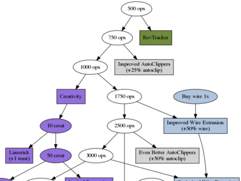

Universal Paperclip Diagrams
==================================================

This is a map of
[Universal Paperclips](http://decisionproblem.com/paperclips/),
the addictive philosophical clicker game by Frank Lantz.
The diagrams consist of all projects and other major milestones in the game, along with their requirements, creating a map of sorts for the game.

The diagrams were created using
[Graphviz](http://graphviz.org/),
with the help of the
[M4 macro language](https://www.gnu.org/software/m4/)
to simplify the repetition of node shapes and colors.

It should go without saying that these diagrams contain spoilers.
I created them to help myself visualize the flow of the game to plan speedruns.

For more info on Universal Paperclips, see the
[game itself](http://decisionproblem.com/paperclips/)
which is free to play in your browser,
or the coverage in
[Wired](https://www.wired.com/story/the-way-the-world-ends-not-with-a-bang-but-a-paperclip/amp),
[Forbes](https://www.forbes.com/sites/insertcoin/2017/10/17/get-sucked-into-the-black-hole-of-paperclips-a-hopelessly-addicting-browser-game/#5be538d24f9b),
or
[The New Yorker](https://www.newyorker.com/culture/culture-desk/the-unexpected-philosophical-depths-of-the-clicker-game-universal-paperclips),

Diagram Organization
--------------------------------------------------

The game is split into four sections:

- Stage 1a ([src](paperclips-diagram-stage1a.dot.m4), [pdf](pdf/paperclips-diagram-stage1a.pdf), [svg](svg/paperclips-diagram-stage1a.svg)): stage 1 up to 20,000 ops and the new era of trust.
- Stage 1b ([src](paperclips-diagram-stage1b.dot.m4), [pdf](pdf/paperclips-diagram-stage1b.pdf), [svg](svg/paperclips-diagram-stage1b.svg)): stage 1 after the new era of trust
- Stage 2 ([src](paperclips-diagram-stage2.dot.m4), [pdf](pdf/paperclips-diagram-stage2.pdf), [svg](svg/paperclips-diagram-stage2.svg))
- Stage 3 ([src](paperclips-diagram-stage3.dot.m4), [pdf](pdf/paperclips-diagram-stage3.pdf), [svg](svg/paperclips-diagram-stage3.svg))

If printed, each section seems to fit decently onto one sheet of paper.
Stage 1 is split for this reason.

Additionally, the build script ([`Makefile`](Makefile)) combines them into different combinations:

- Stage 1 together ([pdf](pdf/paperclips-diagram-combined-stage1.pdf), [svg](svg/paperclips-diagram-combined-stage1.svg))
- Stage 2 and 3 ([pdf](pdf/paperclips-diagram-combined-stage23.pdf), [svg](svg/paperclips-diagram-combined-stage23.svg))
- All three stages ([pdf](pdf/paperclips-diagram-combined-all.pdf), [svg](svg/paperclips-diagram-combined-all.svg))

Game Version
--------------------------------------------------

The diagrams cover v3 of Universal Paperclips, using requirements taken directly from the javascript code which is viewable with any browser's "view source" feature.

Thanks to Mr. Lantz for not minimizing or obfuscating his javascript.
It's really neat to look at the source code, especially the projects file.
Because the projects are numbered in order of their creation,
you can get some insight into how the game grew during development and which features were early vs late additions.
(Lantz's patch notes are also fun to read:
[patch 1](http://decisionproblem.com/paperclips/patch1notes.html)
[patch 2](http://decisionproblem.com/paperclips/patch2notes.html))

In the future, I hope to build an alternate version of these diagrams for the mobile version, which has some slightly different milestones, but it will take some reverse engineering of the different drone and factory cost calculations in stage 2.

Build Process
--------------------------------------------------

The `master` branch of this repository includes rendered files (pdfs and svgs) so that they are more easily accessible on the web.
You can also build pngs, but I am not checking them into the repository because the file sizes are much bigger: 500kb to 2mb.

There is a separate `source` branch that just has the diagram source files.
If you plan to do any development, do it on the `source` branch.

Files:

- [`common.m4`](common.m4) defines shapes and colors for different categories of targets and projects: ops, creative, etc.
- The `*.dot.m4` files contain the Graphviz graph definitions and calls to the macros in `common.m4`
- The [`Makefile`](Makefile) uses `m4` and `dot` to render the graphs in different formats.
- For stage 2, the [`upc_prices.py`](upc_prices.py) Python script calculates factory and drone cost milestones and outputs graphviz code that is included by the `.dot.m4` file.

Author and License
--------------------------------------------------

These diagrams are by Mike Murphy
(<codermurph@sleepymurph.com>,
Twitter:[\@sleepymurph](https://twitter.com/sleepymurph)).
If you use or remix them, give credit to me and more importantly to Frank Lantz.

 This work is licensed under a <a rel="license" href="http://creativecommons.org/licenses/by-nc-sa/4.0/">Creative Commons Attribution-NonCommercial-ShareAlike 4.0 International License</a>.
